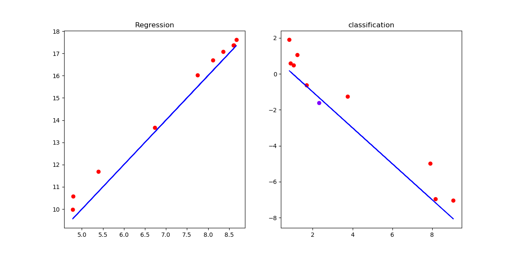
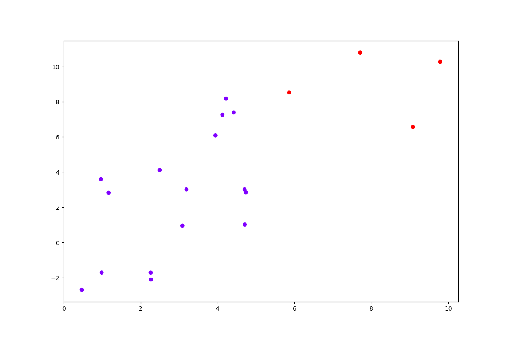

# 机器学习简介
>即使是机器学习领域的专业人士，也很难给机器学习这一概念下一个准确的定义，比较常见的说法有两种。Arthur Samuel描述其为“使计算机无需明确编程就能自主学习的研究领域”，Tom Mitchell给了一个更为流行的解释为“一个计算机程序从经验E中学习某些类型的任务T和性能度量P，如果它在任务T中的性能（以P度量）随着经验E提高了，称之为具有机器学习能力。”

## 简介
- 如今，机器学习作为人工智能的主要研究方向被落地使用于各个行业，机器学习算法的有效及强大备受关注，由基本的机器学习算法衍生了很多子方向如强化学习、深度学习等，这些领域归根结底都是经典的机器学习方法的扩充。
- 一般将机器学习划分为两个类别，即监督学习和无监督学习，前者依据数据的特征和标签，后者只依赖数据的特征。

## 监督学习（Supervised Learning）
- 监督学习是指训练算法的数据集的样本都有实际的标签（label）存在，如房价问题的房价、垃圾邮件识别问题的邮件类别。
- 监督学习主要由分类（Classification）和回归（Regression）两个类别组成，回归问题要求预测连续的输出值如房价，分类问题要求预测离散的输出值如好或者坏。形象地说，回归问题要求找到一个尽量拟合训练数据分布的函数表达，分类问题要求找到一个尽量区分训练数据不太类别数据的分界线。某种程度上，这两种问题可以相互转化。
- 如图，对于回归问题，尽量找到一条拟合全部数据的函数；对于分类问题，尽量找到区分不同类别样本的分界线函数。

## 非监督学习（Unsupervised Learning）
- 非监督是指训练算法的数据集的样本只包含特征，而没有标签、目标之类的信息，我们不知道什么是好什么是坏，我们需要找到尽量区分不同样本的方法，如聚类算法。经典的问题如新闻主题聚合。
- 非监督学习的典型问题是聚类问题，要求找出数据中的类型结构，并划分出来。
- 如图，对于聚类问题，要求发现数据的潜在特性，进行类别划分。

## 发展状况
- 目前，监督学习和非监督学习的发展如火如荼，然而取得较为实用的成就且能用于工业界的大多还是监督学习算法，换句话说，我们仍然需要大量的人工标注的数据用于模型的训练。
- 当然，近些年很多深度学习方法（如自动编码器）被逐渐用于非监督学习领域，这也促使非监督学习的进一步发展。
- 未来的强人工智能应该是更加依赖非监督学习算法，配合以监督学习算法的。

## 补充说明
- 本文力求简洁介绍机器学习的一些基本概念，思路参照吴恩达的机器学习课程（Coursera）。
- 本系列相关的博文和代码开放于Github，欢迎访问[项目](https://github.com/luanshiyinyang/ML)。同时博客也同步在我的[个人博客网站](https://luanshiyinyang.github.io)，欢迎访问查看其他文章。
- 由于能力有限，如有错误，欢迎评论指正。