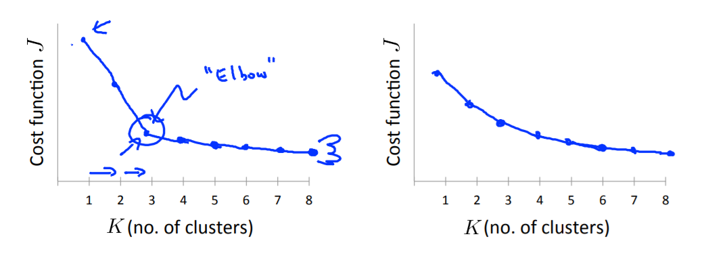
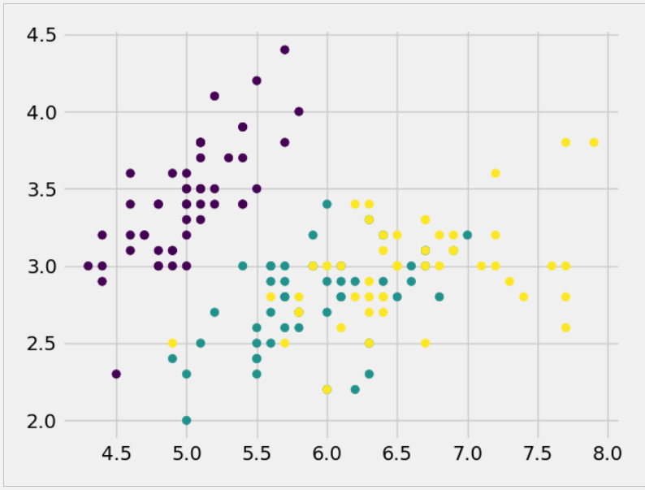
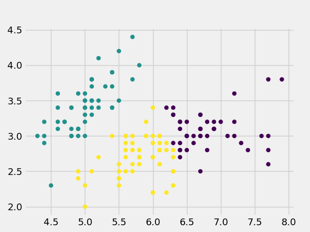

# Kmeans聚类

## 简介
之前提到的算法大多数都是监督学习算法，主要代表是分类和回归问题，但是很多时候想要从数据中发现一些潜在的规律，而数据是没有指标驱动的，即没有标签，这种自学习算法称为非监督学习（Unsupervised Learning）。非监督学习算法的典型代表是聚类（Clustering），分类问题是给定x和y，要求找到一种假设拟合数据的分布，将不同的类别区分开，而聚类问题则是只有x，从中发现一些规律将样本分成区别较大的多个簇。聚类的应用较分类在业界更为广泛，因为标注成本大且易错，最为典型的聚类算法是Kmeans算法。


## 原理
K-means是一种给定聚类数目k的聚类算法，它通过迭代不断调整聚类中心达到聚类的目的，由于聚类中心的调整是基于当前簇的均值决定的，故叫做k均值聚类算法。下面以样本都是二维特征的数据为例（方便可视化），详述算法思路。
1. 随机初始化K个聚类中心。
2. 计算每个样本点到聚类中心的距离（一般欧式距离），样本点离哪个聚类中心最近则将该样本划分到对应簇中；
3. 计算每个簇的各特征均值（本例即x和y坐标的均值），将该簇的聚类中心调整为均值位置；
4. 重复上述2和3步，直到聚类中心稳定不变动。

上述的Kmeans算法存在一些问题，如k个聚类中心的初始化，一旦出现极端情况将很难更新（所有样本离某个中心都是最近，其他中心无法形成簇）。

首先来看Kmeans的优化目标，记$c^{(i)}$为第i个样本的所属簇（类别）的编号，$\mu_k$表示第k个簇的聚类中心。那么优化的目标函数就如下式所示。

$$
J\left(c^{(1)}, \ldots, c^{(m)}, \mu_{1}, \ldots, \mu_{K}\right)=\frac{1}{m} \sum_{i=1}^{m}\left\|x^{(i)}-\mu_{c^{(i)}}\right\|^{2}
$$

优化函数即为如下，只要找到使得J最小的$c$和$\mu$即找到了最优解。

$$
\min _{c^{(1)}, \ldots, c^{(m)} \\ \mu^{(1)}, \ldots, \mu^{(m)}} J\left(c^{(1)}, \ldots, c^{(m)}, \mu_{1}, \ldots, \mu_{K}\right)
$$


## 算法优化
上述的算法原理其实并不是很复杂，但是该算法的应用会出现很多问题，如之前提到的聚类中心初始化，不合适的初始化很容易使得算法收敛到局部最优解，这不是我们希望看到的。
比较常用且有效的聚类中心初始化方法是随机挑选k个训练样本作为聚类初始中心，这种方法叫做随机初始化（random initialization）。

当然，即使随机初始化也可能陷入**局部最优**，因此多次尝试随机初始化，综合多次聚类结果会是不错的选择，综合的方法一般是选择使得代价函数J最小的聚类参数。

还有一个比较值得研究的问题就是如何确定聚类的簇数目K，这引起了较多的研究也产生了一些方法，但是最实用的其实还是人工选择。这是因为，当数据的特征维度较大时，一方面可视化困难，另一方面不同的人对数据的理解不同，所以设计一个自动选择k值的算法是非常困难的。

曾今，肘部法则被使用过，它的思路是绘制代价函数值J关于K的函数，会出现一个明显的拐点，这个点对应的K值就是选择的K值（下图左）。但是，很多时候并不会出现这个拐点，因此难以选出合适的K。所以更加常用的实际上是任务驱动的选择，怎样的K对Kmeans下游任务更加有效，就选这个K。



## 聚类实战
实战基于鸢尾花数据集，其中的标签列不作为训练数据，且选择两列作为特征，方便二维可视化。

数据集的真实分布如下图，可以感受到，由于数据的确实，二维特征区分度不明显，聚类还是比较难的。


实战的源码如下。
```python
"""
Author: Zhou Chen
Date: 2019/12/9
Desc: 简单实现Kmeans聚类算法
"""
import numpy as np
from matplotlib import pyplot as plt
import random
from sklearn.datasets import load_iris
plt.style.use('fivethirtyeight')


def load_data():
    data, target = load_iris()['data'], load_iris()['target']
    # 选取前两列特征，方便可视化
    return data[:, :2], target


def plot_data(x, y):
    plt.scatter(x[:, 0], x[:, 1], c=y)
    plt.savefig('rst.png')
    plt.show()


def rand_centroids(data, k):
    m = data.shape[0]
    # 随机选择k个样本作为初始化的聚类中心
    sample_index = random.sample(list(range(m)), k)
    centroids = data[sample_index]
    # 循环遍历特征值
    return centroids


def compute_dist(vecA, vecB):
    return np.linalg.norm(vecA - vecB)


def kMeans(data, k):
    m, n = np.shape(data)  # 样本量和特征量
    labels = np.array(np.zeros((m, 2)))
    centroids = rand_centroids(data, k)
    cluster_changed = True  # 是否已经收敛
    while cluster_changed:
        cluster_changed = False
        for i in range(m):
            min_dist = np.inf
            min_index = -1
            for j in range(k):
                distJI = compute_dist(centroids[j, :], data[i, :])
                if distJI < min_dist:
                    min_dist = distJI
                    min_index = j
            if labels[i, 0] != min_index:
                cluster_changed = True
            labels[i, :] = min_index, min_dist ** 2
        for cent in range(k):
            ptsInClust = data[np.nonzero(labels[:, 0] == cent)[0]]
            centroids[cent, :] = np.mean(ptsInClust, axis=0)
    # 返回所有的类质心与点分配结果即类别
    return centroids, labels


if __name__ == '__main__':
    data, target = load_data()
    # plot_data(data, target)
    _, label = kMeans(data, 3)
    plot_data(data, label[:, 0])
```

最终的聚类效果如下图，可以看出，和原来的类别比较，聚类效果较为不错。



## 补充说明
本文简单叙述了Kmeans这一聚类模型的简单思想，思路参照吴恩达的机器学习课程（Coursera），除此以外后来产生了很多更为优秀的聚类算法，后续会介绍。
- 本系列相关的博文和代码开放于Github，欢迎访问[项目](https://github.com/luanshiyinyang/ML)。同时博客也同步在我的[个人博客网站](https://luanshiyinyang.github.io)，欢迎访问查看其他文章。
- 由于能力和时间有限，如有错误，欢迎评论指正。