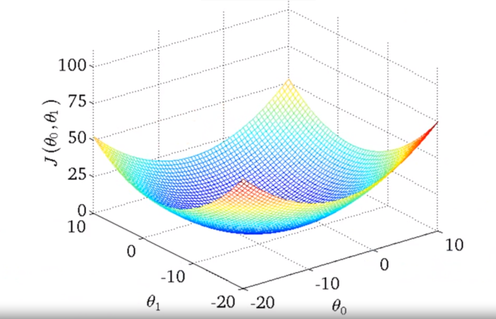
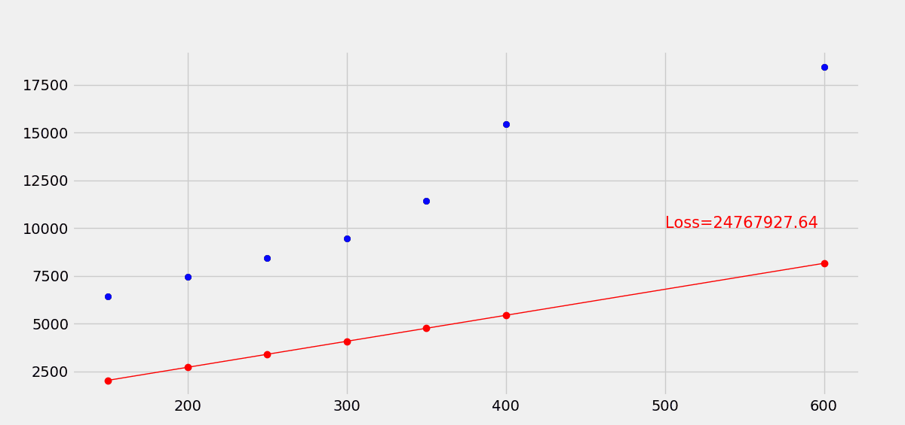

# 线性回归


## 简介
在诸多机器学习算法中，线性回归（Linear Regression，LR）尽管实用性并没有很多高复杂模型高，但是作为机器学习（Machine Learning）最基础的模型，用于理解机器学习的整体思路和流程，线性回归绝对是个不错的选择。线性回归由简单到复杂可以分为单变量线性回归和多变量线性回归，这里的变量（variable）指的是用于训练的数据集的样本只有一个特征


## 一元线性回归
数学上，单变量线性回归的拟合函数式如下式。该式子的含义是用一个线性函数去拟合样本的数据，不断调整$\theta$使得这个函数越来越接近于训练数据的分布，这里的$\theta$就是需要训练的参数（parameters），显然，参数的不同得到的拟合直线也是不同的。这里使用$h$表示预测的输出，其原意是hypothesis function（假设函数）。

$$h_{\theta}(x)=\theta_{0}+\theta_{1} x$$ 

上述线性回归模型的目标就是$h_{\theta}(x)$在某个$\theta$的选择下，尽量接近于真实的$y$的分布，本质上这是个最小化问题。因此需要一个函数来表示预测值与真实值之间的差距，这个函数称为代价函数（cost function，也叫作误差函数）。在线性回归中，通常选择均方误差作为代价函数，也是优化的目标函数（最小化该函数即可）。其中，m表示样本数目。

$$J(\theta) = \frac{1}{2m}\sum_{i=1}^{m}\left(h_{\theta}\left(x^{(i)}\right)-y^{(i)}\right)^{2}
$$

代价函数的设计有很多种，此处之所以选用均方误差是由于实验表明，对于大多数回归问题，均方误差会有不错的表现。最小化代价函数其实是一个最优解查找的问题。对于均方差问题在回归中的表现，通过取不同的$\theta$会得到不同的$J$，绘制其曲线（$j$关于$\theta$）可以发现这是一个凸函数（只有一个全局最优解）。上述的优化问题就是一个凸优化问题，找到使得$J$最小的$\theta$取值即可。


## 梯度下降
在数学上，凸优化问题有诸多解法（如正规方程，其在特征量很少的情况下有效）。其中，梯度下降算法（Gradient Descent）在机器学习领域使用最为广泛，特别是当参数量极为庞大（如神经网络）时，该算法就显得实用很多。
梯度下降算法的思想如下。
  1. 首先，对参数$\theta$做一些猜想，一般均初始化为0。
  2. 不断一点点改变$\theta$值，直到找到$J(\theta)$的最小值或者局部最小值。
其具体实现为每次改变的一点点为梯度的值的很小的一部分，每次改变的方向为梯度的反方向。（因为梯度的正负表示函数值增大的方向，梯度的大小表示增大的速度）其中$\alpha$表示学习速率（learning rate），用于控制梯度更新的幅度，学习率越大更新速度越快越容易陷入局部最优解，一般取值不会大于1（这是因为梯度的值一般比较大）。

$$
\theta_{j}=\theta_{j}-\alpha \frac{\partial}{\partial \theta_{j}} J\left(\theta_{0}, \theta_{1}\right)
$$

这里所说的梯度下降也叫作批量梯度下降（BGD），它指每一轮都是处理整批训练样本，求整个样本的梯度进行更新。

当梯度下降进行到后期，可能会接近最优解从而出现代价函数值来回波动的情况，这是因为较大得学习率不适合微小的调整，难以收敛，此时调整为较小的学习率较为合适。


## 一元线性回归实战
综上，对代价函数的优化以求得最优解从而得到最合适的线性模型，经过梯度推导，参数的具体更新计算如下。

$$
\begin{array}{l}{\theta_{0}=\theta_{0}-\alpha \frac{1}{m} \sum_{i=1}^{m}\left(h_{\theta}\left(x^{(i)}\right)-y^{(i)}\right)} \\ {\theta_{1}=\theta_{1}-\alpha \frac{1}{m} \sum_{i=1}^{m}\left(h_{\theta}\left(x^{(i)}\right)-y^{(i)}\right) \cdot x^{(i)}}\end{array}
$$

实现一元线性回归，数据集采用很简单的一个只有房子面积这个特征的房价数据集，实现运算主要采用Numpy。<div align="center"></div>
**需要注意，在数据量很少的情况下使用高学习率是不明智的，因为数值变化过快很难进行收敛。本案例就出现了这种情况。**
```python
"""
Author: Zhou Chen
Date: 2019/10/30
Desc: Linear Regression
"""
import numpy as np
import pandas as pd
import matplotlib.pyplot as plt
plt.style.use('fivethirtyeight')
fig = plt.gcf()
fig.set_size_inches(12, 6)

data = pd.read_csv("../data/data.csv")
x = data['square_feet'].values
y = data['price'].values


def plot_h(x, y, theta, loss):
    plt.scatter(x[:, 1].reshape(-1, 1), y, color='b')
    plt.plot(x[:, 1].reshape(-1, 1), x@theta, color='r', linewidth=1, marker='o')
    plt.text(500, 10000, 'Loss={:.2f}'.format(loss), fontdict={'size': 15, 'color': 'red'})


def loss_func(x, y, theta):
    pred = x @ theta
    loss = np.sum((pred - y.reshape(-1, 1)) ** 2) / (x.shape[0]*2)
    return loss


class LinearRegression(object):
    """
    实现单变量线性回归模型
    """

    def __init__(self):
        self.theta = np.zeros([2, 1])

    def fit(self, x_train, y_train, learning_rate=0.01, epochs=10):
        """
        实现回归模型的训练
        :param x_train:
        :param y_train:
        :return:
        """
        plt.ion()
        for epoch in range(epochs):
            x = np.hstack((np.ones([x_train.shape[0], 1]), x_train.reshape(-1, 1)))
            grad = (x @ self.theta) - y_train.reshape(-1, 1)
            self.theta[0, 0] = self.theta[0, 0] - learning_rate * (np.sum(grad) / x.shape[0])
            self.theta[1, 0] = self.theta[1, 0] - learning_rate * (np.sum((grad * x[:, 1].reshape(-1, 1))) / x.shape[0])
            loss = loss_func(x, y_train, self.theta)
            print('loss', loss)
            import time
            time.sleep(1)
            plt.cla()
            plot_h(x, y_train, self.theta, loss)

            plt.pause(0.1)
        plt.ioff()
        plt.show()


if __name__ == '__main__':
    lr = LinearRegression()
    lr.fit(x, y, learning_rate=0.000001, epochs=30)
```
使用梯度下降优化损失函数，最终经过30轮训练，拟合效果变化如下。


## 多元线性回归
一元线性回归适用于拟合单特征的数据集，然而，事实上的数据样本集，几乎没有单特征的数据集，任何的结果（y）都是多个因素（x）共同作用的。因此数据变为了如下的格式，拟合的估计函数变为了下式（这可以推广到n维特征）。<div align="center"></div>
为了方便运算，通常会将数据集加上一个数值全为1特征列，用于和$x_0$相乘，这样方便了矩阵运算。
$$
h_{\theta}(x)=\theta_{0}+\theta_{1} x_{1}+\theta_{2} x_{2}+\cdots+\theta_{n} x_{n}
$$
因此，矩阵形式定义如下。
$$
x=\left[\begin{array}{c}{x_{0}} \\ {x_{1}} \\ {x_{2}} \\ {\vdots} \\ {x_{n}}\end{array}\right] \in \mathbb{R}^{n+1}
$$
$$
\theta=\left[\begin{array}{c}{\theta_{0}} \\ {\theta_{1}} \\ {\theta_{2}} \\ {\vdots} \\ {\theta_{n}}\end{array}\right] \in \mathbb{R}^{n+1}
$$
$$
\begin{aligned} h_{\theta}(x) &=\theta_{0} x_{0}+\theta_{1} x_{1}+\cdots+\theta_{n} x_{n} \\ &=\theta^{\top} x \end{aligned}
$$

损失函数的定义可以认为是不变的，只是$h(\theta)$的计算方式不同而已。同时，通过补上全1的特征列，每个参数的更新法则就是一致的了。
$$
J(\theta) = \frac{1}{2m}\sum_{i=1}^{m}\left(h_{\theta}\left(x^{(i)}\right)-y^{(i)}\right)^{2}
$$
$$
\theta_{j}=\theta_{j}-\alpha  \frac{1}{m} \sum_{i=1}^{m}\left(h_{\theta}\left(x^{(i)}\right)-y^{(i)}\right) x_{j}^{(i)}
$$

这里也可以推断，当参数选择的特征不是$x$而是$x^{2}$或者$X_{1}x_{2}$，相当于建立了高次模型，这就不是线性回归了，而是多项式回归（Polynomial Regression），它可以拟合更复杂的数据，但是其本质上任然是特征组合后新数据集的线性模型。
$$
h_(\theta) = \theta_{0}+\theta_{1} x+\theta_{2} x^{2}
$$


## 特征缩放（Feature Scaling）
当特征的量很多时，不同特征的尺度是不一样的，比如有个特征的取值是[0-5]，另一个特征的取值是[0-2000]，很明显只要后者对应的$\theta$稍微改变对预测值的变化影响是巨大的，这就导致对不同参数的优化力度不同，优化很难进行（如果了解KNN原理，特征的尺度差异影响有多么恐怖就显而易见了）。

这种情况，特征的缩放就是一个很有效的手段，它是的各个特征的尺度是一致的。如对上述的第一个特征除以5，第二个特征除以2000，那么两者都被调整到[0-1]的范围内。事实上，可以定义一个粗略的标准化公式，式子中的$\mu$表示所有样本该特征的均值，$S$表示所有样本该特征的范围（最大值减最小值即可，也可以使用标准差，影响不大，比较特征缩放只是为了梯度下降更为迅速）。
$$
x \leftarrow \frac{x-\mu} {S}
$$

## 补充说明
- 本文简单叙述了线性回归这一回归模型的简单思想，思路参照吴恩达的机器学习课程（Coursera）。
- 本系列相关的博文和代码开放于Github，欢迎访问[项目](https://github.com/luanshiyinyang/ML)。同时博客也同步在我的[个人博客网站](https://luanshiyinyang.github.io)，欢迎访问查看其他文章。
- 由于能力有限，如有错误，欢迎评论指正。