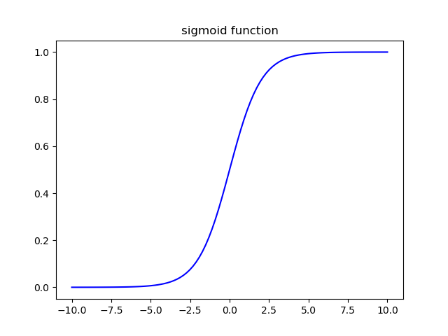

# 逻辑回归

## 简介
就如线性回归是经典的回归模型一般，逻辑回归（Logistic Regression）是分类问题解决方案中比较经典的模型。不同于回归预测，分类问题要预测的值并非连续的，而是离散的。如果分类的目标（标签）只有两种取值（0或1，正例或负例），称为二分类问题。如果标签的取值在三种及三种以上，称为多分类问题。

## 逻辑回归
试图用线性回归这样的模型寻找分类的决策边界，会遇到很多问题，如难以控制输出值的范围。事实上，要想对这个模型得到可控制的输出值，可以将原来线性回归的输出值进行某种变换，使其值控制在[0, 1]之间。

$$
\begin{aligned} h_{\theta}(x) &=g\left(\theta^{T} x\right) \\ g(z) &=\frac{1}{1+e^{-z}} \end{aligned}
$$
因而，得到最终的假设函数（预测函数）如下，其输出值可以理解为类别的概率（更具体来说，输出的值为y=1的概率）。

$$
h_{\theta}(x) = \frac{1}{1+e^{-\theta^Tx}}
$$

上述的g函数将任何实数映射到[0, 1]之间，该函数称为Sigmoid函数或者Logistic函数，Sigmoid是经典的S型函数之一。
而训练的目标，就是找到最合适的参数$\theta$使得由$\theta$构成的模型能够最完美的将不同的类别划分开，找到的最合适的$\theta^{T}x$就称为决策边界（Decision Boundary）。越是复杂越是非线性的决策边界可以更好地进行分类，而决策边界并非数据集的属性而是假设函数和参数的属性。**获得更复杂更精准的决策边界，就是分类任务的目的。**

## 参数求解
参数求解的问题依然是一个优化问题，因此需要代价函数来衡量，在线性回归中下面的代价函数的表现比较不错，但是在逻辑回归中依然使用这个函数会出现$J(\theta)$关于$\theta$的函数是非凸（non-convex）的（这是由于sigmoid非线性激活导致输出的波动状态），非凸函数的优化是比较困难的（使用梯度下降难以到达全局最优解）。

因此，在逻辑回归中定义代价函数如下。

$$
\operatorname{cost}\left({h}_{{\theta}}(x), y\right)=\left\{\begin{aligned}-\log \left(h_{\theta}(x)\right) & \text { if } y=1 \\-\log \left(1-h_{\theta}(x)\right) & \text { if } y=0 \end{aligned}\right.
$$

上式可以统一为一个表达式（可以轻易证明），它更加简洁也更加方便求导，这个损失函数叫做交叉熵损失函数，交叉熵损失函数是分类问题最常用的损失函数之一。至于为什么这样定义这个损失函数，其实是使用最大似然估计法从统计数据中得到的，而且，这是一个凸函数。

$$
\begin{aligned} J(\theta) &=\frac{1}{m} \sum_{i=1}^{m} \operatorname{cost}\left(h_{\theta}\left(x^{(i)}\right), y^{(i)}\right) \\ &=-\frac{1}{m}\left[\sum_{i=1}^{m} y^{(i)} \log h_{\theta}\left(x^{(i)}\right)+\left(1-y^{(i)}\right) \log \left(1-h_{\theta}\left(x^{(i)}\right)\right)\right] \end{aligned}
$$

通过最小化上述的$J$得到合适的$\theta$以拟合训练数据，这个最优参数$\theta$的求解通过梯度下降法完成，更新的方式如下（可以看到，相比于线性回归，逻辑回归只是预测函数改变了）。

$$
\theta_{j}=\theta_{j}-\alpha \sum_{i=1}^{m}\left(h_{\theta}\left(x^{(i)}\right)-y^{(i)}\right) x_{j}^{(i)}
$$
