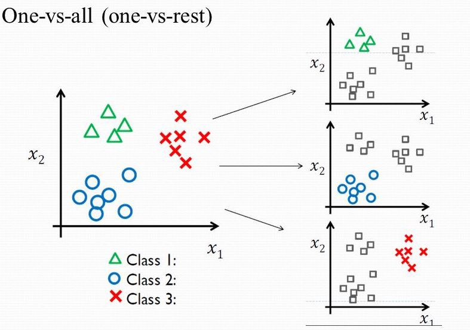

# 逻辑回归

## 简介
就如线性回归是经典的回归模型一般，逻辑回归（Logistic Regression）是分类问题解决方案中比较经典的模型。不同于回归预测，分类问题要预测的值并非连续的，而是离散的。如果分类的目标（标签）只有两种取值（0或1，正例或负例），称为二分类问题。如果标签的取值在三种及三种以上，称为多分类问题。

## 逻辑回归
试图用线性回归这样的模型寻找分类的决策边界，会遇到很多问题，如难以控制输出值的范围。事实上，要想对这个模型得到可控制的输出值，可以将原来线性回归的输出值进行某种变换，使其值控制在[0, 1]之间。

$$
\begin{aligned} h_{\theta}(x) &=g\left(\theta^{T} x\right) \\ g(z) &=\frac{1}{1+e^{-z}} \end{aligned}
$$
因而，得到最终的假设函数（预测函数）如下，其输出值可以理解为类别的概率（更具体来说，输出的值为y=1的概率）。

$$
h_{\theta}(x) = \frac{1}{1+e^{-\theta^Tx}}
$$

上述的g函数将任何实数映射到[0, 1]之间，该函数称为Sigmoid函数或者Logistic函数，Sigmoid是经典的S型函数之一。
而训练的目标，就是找到最合适的参数$\theta$使得由$\theta$构成的模型能够最完美的将不同的类别划分开，找到的最合适的$\theta^{T}x$就称为决策边界（Decision Boundary）。越是复杂越是非线性的决策边界可以更好地进行分类，而决策边界并非数据集的属性而是假设函数和参数的属性。**获得更复杂更精准的决策边界，就是分类任务的目的。**

## 参数求解
参数求解的问题依然是一个优化问题，因此需要代价函数来衡量，在线性回归中下面的代价函数的表现比较不错，但是在逻辑回归中依然使用这个函数会出现$J(\theta)$关于$\theta$的函数是非凸（non-convex）的（这是由于sigmoid非线性激活导致输出的波动状态），非凸函数的优化是比较困难的（使用梯度下降难以到达全局最优解）。

因此，在逻辑回归中定义代价函数如下。

$$
\operatorname{cost}\left({h}_{{\theta}}(x), y\right)=\left\{\begin{aligned}-\log \left(h_{\theta}(x)\right) & \text { if } y=1 \\-\log \left(1-h_{\theta}(x)\right) & \text { if } y=0 \end{aligned}\right.
$$

上式可以统一为一个表达式（可以轻易证明），它更加简洁也更加方便求导，这个损失函数叫做交叉熵损失函数，交叉熵损失函数是分类问题最常用的损失函数之一。至于为什么这样定义这个损失函数，其实是使用最大似然估计法从统计数据中得到的，而且，这是一个凸函数。

$$
\begin{aligned} J(\theta) &=\frac{1}{m} \sum_{i=1}^{m} \operatorname{cost}\left(h_{\theta}\left(x^{(i)}\right), y^{(i)}\right) \\ &=-\frac{1}{m}\left[\sum_{i=1}^{m} y^{(i)} \log h_{\theta}\left(x^{(i)}\right)+\left(1-y^{(i)}\right) \log \left(1-h_{\theta}\left(x^{(i)}\right)\right)\right] \end{aligned}
$$

通过最小化上述的$J$得到合适的$\theta$以拟合训练数据，这个最优参数$\theta$的求解通过梯度下降法完成，更新的方式如下（可以看到，相比于线性回归，逻辑回归只是预测函数改变了）。

$$
\theta_{j}=\theta_{j}-\alpha \sum_{i=1}^{m}\left(h_{\theta}\left(x^{(i)}\right)-y^{(i)}\right) x_{j}^{(i)}
$$

## 逻辑回归实战
通过构建逻辑回归模型，训练该模型并可视化训练过程。数据集采用一个包含两个特征的二分类数据集。

 

经过多轮梯度下降，逐渐找到最合适的决策边界。

## 多分类问题
二分类是最简单的分类问题，因为目标类别只有两种，非0则1，然而实际上的分类问题是多个类别的（成百上千）。之前的逻辑回归可以很好地解决二分类问题，一个样本不是正类就是父类，关于多分类问题的求解可以依靠这个基本原理。

常用的多分类思路是“一对多”（one vs all，或者“一对其他”， one vs other），它的基本思想简单粗暴，构建多个分类器（每个分类器针对一个估计函数）针对每个类别，每个分类器学会识别“是或者不是”该类别，这样就简化为多个二分类问题。用多个逻辑回归作用于待预测样本，返回的最高值作为最后的预测值。

## 过拟合问题
模型的训练并不会像想象中那么美好，大量的样本，高维的特征，都会给训练带来各种各样的问题。

过拟合问题（overfitting）是机器学习常见的问题之一，它的出现原因是模型过度拟合训练数据从而导致对测试数据没有任何的泛化能力。过拟合问题表现为高方差。

欠拟合问题（underfitting）也是机器学习中的一个问题，只是出现频率不高，它的出现原因是模型并没有充分学习到足够的知识，从而模型没有任何的预测能力。欠拟合问题表现为高偏差。

如果样本量很少，但是特征量很大，过拟合非常容易发生。这是因为过多的特征会带来过多的参数，过多的参数会拟合一个非常复杂的模型。防止过拟合的方法有不少，主要有下面几种。
- 减少特征
  - 删除部分特征，迫使模型区域简单化。
  - 缺点是必然丢弃了一些目标相关的信息，而且删除特征的选择也是一个问题。
- 正则化（Regularization）
  - 不改变参数的数量，但是减少参数的数值，迫使每个参数为模型贡献一小部分。
  - 实验证明，正则化后的模型效果较好。

其实正则化这种限制每个参数的手段是通过在代价函数中添加惩罚项实现的。这些惩罚使得模型的高次特征的参数很接近0。实现这样的惩罚并不难，只要在代价函数中添加系数很大的参数项即可，此时要想最小化代价函数，这些大系数的参数小必须很小（接近0），从而达到惩罚的目的。

正规化的代价函数如下，相比于之前的代价函数添加了以$\lambda$为系数的一项，这里的$\lambda$就是惩罚力度（正则化参数），即前面所说的较大的系数（不能太大，否则无法学习）。现在优化的目标就是最小化这个代价函数。

$$
J(\theta)=\frac{1}{2 m}\left[\sum_{i=1}^{m}\left(h_{\theta}\left(x^{(i)}\right)-y^{(i)}\right)^{2}+\lambda \sum_{j=1}^{n} \theta_{j}^{2}\right]
$$

这样，梯度下降的更新公式如下，$\theta_{0}是不需要惩罚的$。
$$
\theta_{0}=\theta_{0}-\alpha \frac{1}{m} \sum_{i=1}^{m}\left(h_{\theta}\left(x^{(i)}\right)-y^{(i)}\right) x_{0}^{(i)}
$$
$$
\theta_{j}=\theta_{j}-{\alpha}\left[\frac{1}{m} \sum_{i=1}^{m}\left(h_{\theta}\left(x^{(i)}\right)-y^{(i)}\right) x_{j}^{(i)}+\frac{\lambda}{m} \theta_{j}\right]
$$

不论是线性回归或者是逻辑回归或者其他机器学习模型，添加正则项通常是防止过拟合的有效手段。

## 补充说明
- 本文简单叙述了逻辑回归这一分类模型的简单思想，思路参照吴恩达的机器学习课程（Coursera）。
- 本系列相关的博文和代码开放于Github，欢迎访问[项目](https://github.com/luanshiyinyang/ML)。同时博客也同步在我的[个人博客网站](https://luanshiyinyang.github.io)，欢迎访问查看其他文章。
- 由于能力有限，如有错误，欢迎评论指正。