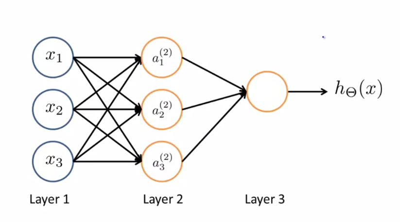
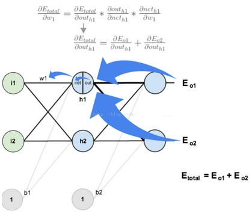
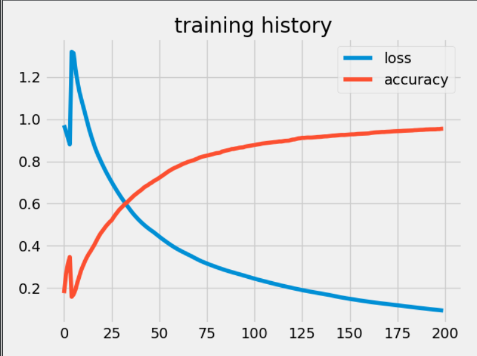

# 神经网络


## 简介
神经网络是一个相当古老的算法，在支持向量机的统治时期，其效果备受质疑，但是，随着机器学习的发展以及深度网络的产生，深度神经网络已经成为很多问题的首选模型（sota方法）。如果说之前的很多问题可以通过线性回归或者逻辑回归这类模型通过构建多项式特征达到非线性拟合效果，那么对于图片（每个像素点就是一个特征）这样的数据，逻辑回归等模型构建的特征量是非常庞大的，而神经网络则采用模拟人脑这一最为强大的学习器的方法建立层层非线性变换的模型，它可以自动学习任意的特征项的组合。


## 模型表示
神经网络模型的建立依据动物的神经元反应机制，每个神经元将所有的输入整合并通过激活函数（非线性函数，如S型函数）激活后输出，多个神经元构成一个隐藏层（hidden layer），层与层之间的连接权重就是机器学习模型中常说的参数，每层神经元之外也可以增加一个节点，通常叫做偏置节点。通常数据特征输入也表示为一层，称为输入层，输出结果层（单个或者多个神经元）称为输出层，中间进行非线性变换的都称为隐藏层。层间连线上的值就是需要学习的权重。


通过上述描述，可以看到每个神经元的运算就是一个比较简单的逻辑回归运算，不难推导，按照矩阵运算，下一层神经元的输入为上一层神经元经过权重变换得到的结果激活后的结果。
$$ Y = sigmoid(WX + bias) $$
上述的运算层层进行的过程称为前向传播，理论上只要堆叠的层数足够深，神经网络可以拟合任意分布的数据，然而，过深的网络，训练的难度也会增加。


## 模型训练
模型的训练主要是依靠反向传播算法（BP）进行的，其核心是通过前向传播的权重矩阵反向计算，将输出层每个神经元的损失值传回上一层神经元供计算权重更新的梯度，然后依据梯度下降算法更新权重。



## 模型应用
神经网络这种模型既可以用于监督学习又可以用于非监督模型，只是调整损失函数而已。之前，对于多分类问题，主要使用one vs all策略，即构建多个分类器，而在神经网络中则可以将最后一层的输出设置为类别个数，这样每个输出层节点的值就是相应类别的得分（score）或者概率（softmax）激活，将得分最高的作为最终预测类别，计算损失，依据反向传播算法更新权重。

下面，构建一个只包含一个隐藏层的神经网络用于手写体分类。数据集采用一个手写数字数据集。
```python
"""
Author: Zhou Chen
Date: 2019/11/13
Desc: About
"""
import numpy as np
import scipy.io as scio
from sklearn.preprocessing import LabelBinarizer
import matplotlib.pyplot as plt
plt.style.use('fivethirtyeight')


def sigmoid(x):
    return 1 / (1+np.exp(-x))


def sigmoid_grad(x):
    return x * (1-x)


def one_hot(x):
    array = np.zeros(shape=[10, 1])
    array[x-1, 0] = 1
    return array


def plot_his(his):
    """
    绘制训练过程
    :param his:
    :return:
    """
    plt.plot(np.arange(len(his['loss'])), his['loss'], label='loss')
    plt.plot(np.arange(len(his['accuracy'])), his['accuracy'], label='accuracy')
    plt.title('training history')
    plt.legend(loc=0)
    plt.show()


def mse(y_label, y_pred):
    y_pred = np.squeeze(y_pred, axis=-1)
    if y_label.shape == y_pred.shape:
        return np.sum((y - y_pred)**2 / y.shape[0])
    else:
        print("no match shape")
        return None


class BPNet(object):

    def __init__(self):
        """
        构建单隐层神经网络
        """
        self.weights = None  # 列表存放两层的参数
        self.bias = None
        self.history = {'loss': [], 'accuracy': []}  # loss和accuracy的历史

    def train(self, x, y, trained_weights=None, learning_rate=1e-3, epochs=100):
        if trained_weights:
            # 传入预训练参数进行训练
            self.weights = [trained_weights[0][:, 1:], trained_weights[1][:, 1:]]
            self.bias = [trained_weights[0][:, 0], trained_weights[1][:, 0]]
        else:
            # 未传入则初始化参数
            print("init weights")
            self.weights = [np.random.normal(size=[25, 400]), np.random.normal(size=[10, 25])]
            self.bias = [np.random.normal(size=[25, 1]), np.random.normal(size=[10, 1])]

        for epoch in range(epochs):
            for i in range(x.shape[0]):
                img = x[i].reshape(-1, 1)
                label = y[i].reshape(-1, 1)
                # forward
                # 隐藏层计算
                input_hidden = self.weights[0] @ img + self.bias[0].reshape(-1, 1)   # [25, 400] @ [400, 1] + [25, 1] => [25, 1]
                output_hidden = sigmoid(input_hidden)
                # 输出层计算
                input_output = self.weights[1] @ output_hidden + self.bias[1].reshape(-1, 1)   # [10, 25] @ [25, 1] + [10, 1] => [10, 1]
                output_output = sigmoid(input_output)
                # backward
                output_error = sigmoid_grad(output_output) * (label - output_output)
                hidden_error = sigmoid_grad(output_hidden) * (self.weights[1].T @ output_error)
                # 参数更新
                self.weights[1] += (output_error @ output_hidden.T) * learning_rate
                self.bias[1] += output_error * learning_rate
                self.weights[0] += (hidden_error @ img.T) * learning_rate
                self.bias[0] += hidden_error * learning_rate
            # 计算损失
            pred_epoch = np.argmax(np.squeeze(self.predict(x), axis=-1), axis=1)
            y_true = np.argmax(y, axis=1)  # onehot还原为标签
            acc = np.sum(pred_epoch.reshape(-1, 1) == y_true.reshape(-1, 1)) / y.shape[0]
            loss = mse(y, self.predict(x))
            self.history['loss'].append(loss)
            self.history['accuracy'].append(acc)
            print("epoch {}, loss {}, accuracy {}".format(epoch, loss, acc))

            # 添加早停
            if epoch > 10 and abs(self.history['loss'][-1] - self.history['loss'][-2]) < 1e-5:
                break
        return self.history

    def predict(self, x, trained_weights=None):
        if trained_weights:
            # 传入预训练参数进行预测
            self.weights = [trained_weights[0][:, 1:], trained_weights[1][:, 1:]]
            self.bias = [trained_weights[0][:, 0], trained_weights[1][:, 0]]

        if self.weights is None:
            print("no weights, cannot predict")

        result = []
        for i in range(x.shape[0]):
            img = x[i].reshape(-1, 1)
            # 隐藏层计算
            input_hidden = self.weights[0] @ img + self.bias[0].reshape(-1, 1)  # [25, 400] @ [400, 1] + [25, 1] => [25, 1]
            output_hidden = sigmoid(input_hidden)
            # 输出层计算
            input_output = self.weights[1] @ output_hidden + self.bias[1].reshape(-1, 1)  # [10, 25] @ [25, 1] + [10, 1] => [10, 1]
            output_output = sigmoid(input_output)
            result.append(output_output)
        return np.array(result)


if __name__ == '__main__':
    data = scio.loadmat('../data/ex3data1.mat')  # 读取数据集
    pretrained_weights = scio.loadmat('../data/ex3weights.mat')  # 读取预训练参数
    X, y = data['X'], data['y']  # 按照索引取出data和label
    y = LabelBinarizer().fit_transform(y)
    w_hidden, w_output = pretrained_weights['Theta1'], pretrained_weights['Theta2']
    # 构建模型
    net = BPNet()
    # 载入预训练参数
    pred_result = net.predict(X, [w_hidden, w_output])
    pred_result = np.argmax(np.squeeze(pred_result, axis=-1), axis=1)
    y_true = np.argmax(y, axis=1)
    print("载入参数前向传播准确率", np.sum(pred_result.reshape(-1, 1) == y_true.reshape(-1, 1)) / y.shape[0])
    # 利用BP算法训练网络模型
    his = net.train(X, y, learning_rate=1e-1, epochs=200)
    plot_his(his)

```
可视化训练过程，结果如下。



## 补充说明
- 本文简单叙述了神经网络的简单思想并进行简单的单隐层网络实验，思路参照吴恩达的机器学习课程（Coursera）。
- 本系列相关的博文和代码开放于Github，欢迎访问[项目](https://github.com/luanshiyinyang/ML)。同时博客也同步在我的[个人博客网站](https://luanshiyinyang.github.io)，欢迎访问查看其他文章。
- 由于能力有限，如有错误，欢迎评论指正。