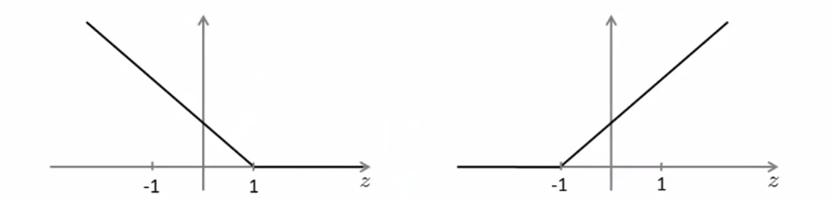
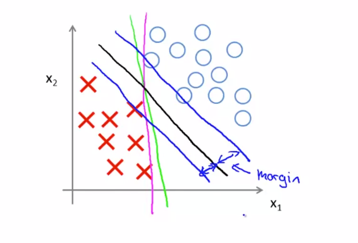

# 支持向量机

## 简介
支持向量机是机器学习中使用最为广泛的算法之一，它被广泛用于学术界和工业界，在深度学习还没有收到今天如此之多的关注的20世纪末21世纪初，支持向量机几乎主导了整个机器学习的世界。

## 原理
对于逻辑回归的假设函数已经不陌生了，它的原理很简单，利用sigmoid函数将线性运算的结果进行非线性变换从而得到(0,1)之间的概率输出。

$$
h_{\theta}(x)=\frac{1}{1+e^{-\theta^{T} x}}
$$

在上述的预测函数下，当处理二分类问题时，有下面两种情况。
1. 若$y=1$，我们希望$h_\theta(x) \approx 1, \theta^Tx \gg 0$；
2. 若$y=0$，我们希望$h_\theta(x) \approx 0, \theta^Tx \ll 0$。

在知道逻辑回归中分类问题所使用的代价函数如下，不妨绘制cost关于z的函数曲线（$z = \theta^Tx$），这必然是一条连续曲线，两种情况下的曲线做线性处理（斜率大的部分改为线性函数，斜率小的部分改为0值函数，由于$y=0$和$y=1$时函数图像镜像，因此两种情况下的修改后函数不同，称为cost0和cost1）。

$$
cost = -\left(y \log h_{\theta}(x)+(1-y) \log \left(1-h_{\theta}(x)\right)\right)
$$

通过上述的变换，支持向量机的优化目标就变为下式。

$$
\min _{\theta} C \sum_{i=1}^{m}\left[y^{(i)} \cos t_{1}\left(\theta^{T} x^{(i)}\right)+\left(1-y^{(i)}\right) \cos t_{0}\left(\theta^{T} x^{(i)}\right)\right]+\frac{1}{2} \sum_{i=1}^{n} \theta_{j}^{2}
$$

这样，我们就可以根据优化目标得到合适的$\theta$从而能够训练得到合适的模型，但是很难直观上理解为什么这样修改，为什么SVM被称为最大间距分类器。cost0和cost1函数如下。

要想最小化总的代价函数，需要满足下面两个条件。
1. 若$y=0$，我们希望$\theta^Tx \geq 1$（不仅仅$\geq 0$）；
2. 若$y=1$，我们希望$\theta^Tx \leq -1$（不仅仅$\leq 0$）。
上述的要求说明，不仅仅满足正确分类，在此基础上，还要有个安全的间距保证。在二分类的例子中，SVM不仅仅找到一个决策边界将两种样本区分开，而且要保证决策边界距离两种样本的分布区域足够远，这样，当新的测试样本出现时不至于分类错误，模型泛化能力变强。

上述为SVM作为最大间距分类器的直观理解，更具体的数学解释可以通过向量投影完成。

## 核函数
如果SVM只能处理线性可分的数据，那么它不足以在较长的时间内“统治”机器学习算法世界。

## 补充说明
- 本文简单叙述了支持向量机的原理并进行了简单的实验，思路参照吴恩达的机器学习课程（Coursera）。
- 本系列相关的博文和代码开放于Github，欢迎访问[项目](https://github.com/luanshiyinyang/ML)。同时博客也同步在我的[个人博客网站](https://luanshiyinyang.github.io)，欢迎访问查看其他文章。
- 由于能力有限，可能写的有所疏漏，如有错误，欢迎评论指正。