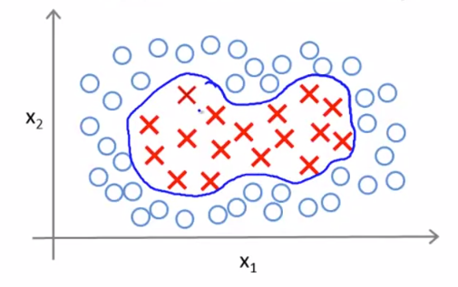

# 支持向量机

## 简介
支持向量机是机器学习中使用最为广泛的算法之一，它被广泛用于学术界和工业界，在深度学习还没有收到今天如此之多的关注的20世纪末21世纪初，支持向量机几乎主导了整个机器学习的世界。

## 原理
对于逻辑回归的假设函数已经不陌生了，它的原理很简单，利用sigmoid函数将线性运算的结果进行非线性变换从而得到(0,1)之间的概率输出。

$$
h_{\theta}(x)=\frac{1}{1+e^{-\theta^{T} x}}
$$

在上述的预测函数下，当处理二分类问题时，有下面两种情况。
1. 若$y=1$，我们希望$h_\theta(x) \approx 1, \theta^Tx \gg 0$；
2. 若$y=0$，我们希望$h_\theta(x) \approx 0, \theta^Tx \ll 0$。

在知道逻辑回归中分类问题所使用的代价函数如下，不妨绘制cost关于z的函数曲线（$z = \theta^Tx$），这必然是一条连续曲线，两种情况下的曲线做线性处理（斜率大的部分改为线性函数，斜率小的部分改为0值函数，由于$y=0$和$y=1$时函数图像镜像，因此两种情况下的修改后函数不同，称为cost0和cost1）。

$$
cost = -\left(y \log h_{\theta}(x)+(1-y) \log \left(1-h_{\theta}(x)\right)\right)
$$

通过上述的变换，支持向量机的优化目标就变为下式。

$$
\min _{\theta} C \sum_{i=1}^{m}\left[y^{(i)} \cos t_{1}\left(\theta^{T} x^{(i)}\right)+\left(1-y^{(i)}\right) \cos t_{0}\left(\theta^{T} x^{(i)}\right)\right]+\frac{1}{2} \sum_{i=1}^{n} \theta_{j}^{2}
$$

这样，我们就可以根据优化目标得到合适的$\theta$从而能够训练得到合适的模型，但是很难直观上理解为什么这样修改，为什么SVM被称为最大间距分类器。cost0和cost1函数如下。

要想最小化总的代价函数，需要满足下面两个条件。
1. 若$y=0$，我们希望$\theta^Tx \geq 1$（不仅仅$\geq 0$）；
2. 若$y=1$，我们希望$\theta^Tx \leq -1$（不仅仅$\leq 0$）。
上述的要求说明，不仅仅满足正确分类，在此基础上，还要有个安全的间距保证。在二分类的例子中，SVM不仅仅找到一个决策边界将两种样本区分开，而且要保证决策边界距离两种样本的分布区域足够远，这样，当新的测试样本出现时不至于分类错误，模型泛化能力变强。

上述为SVM作为最大间距分类器的直观理解，更具体的数学解释可以通过向量投影完成。

## 核函数
如果SVM只能处理线性可分的数据，那么它不足以在较长的时间内“统治”机器学习算法世界。事实上，SVM对于非线性分类问题也有着很好的处理方法，这主要是通过核函数实现的。

核函数的作用就是将低维特征时无法线性分类的数据映射到高维空间，而在高维空间这些数据是线性可分的。核函数的作用就是对原有的特征进行某种定义的变换，从而得到高维的组合特征，进而得到一条高维的直线，在低维空间可能是个曲线。

我们将上述的映射定义为$\phi (x)$，那么求解约束最优化问题就变为下面的问题。

$$
\min _{\alpha} \quad \frac{1}{2} \sum_{i=1}^{N} \sum_{j=1}^{N} \alpha_{i} \alpha_{j} y_{i} y_{j}\left(\phi_{i} \cdot \phi_{j}\right)-\sum_{i=1}^{N} \alpha_{i}
$$

但是，从输入空间到特征空间的这种映射会使得维度发生爆炸式的增长，因此上述问题的内积$\phi_{i} \cdot \phi_{j}$的运算复杂度会高到无法承受的地步，因此通常构造如下的核函数，从而避免在特征空间内的运算，只需要在输入空间内就可以进行特征空间的内积运算。但是，想要构造核函数$\kappa$，首先要确定输入空间到特征空间的映射，但是很多情况下自己处理数据的分布是未知的。通常使用常用的核函数来处理。

$$
\kappa\left(x_{i}, x_{j}\right)=\phi\left(x_{i}\right) \cdot \phi\left(x_{j}\right)
$$

常用的核函数主要有**线性核函数、多项式核函数、高斯径向基核函数、sigmoid核函数**等，其中RBF（径向基函数）使用较多，其定义如下。

$$
\kappa\left(x, x_{i}\right)=\exp \left(-\frac{\left\|x-x_{i}\right\|^{2}}{\delta^{2}}\right)
$$

## SVM训练
关于SVM的模型构建并不需要花费太多的经历，自己构建这样一个模型始终是吃力不讨好的事情，各种编程语言都有自己的机器学习工具库，其中已经实现了SVM算法。

## 补充说明
- 本文简单叙述了支持向量机的原理并进行了简单的实验，思路参照吴恩达的机器学习课程（Coursera）。
- 本系列相关的博文和代码开放于Github，欢迎访问[项目](https://github.com/luanshiyinyang/ML)。同时博客也同步在我的[个人博客网站](https://luanshiyinyang.github.io)，欢迎访问查看其他文章。
- 由于能力有限，可能写的有所疏漏，如有错误，欢迎评论指正。